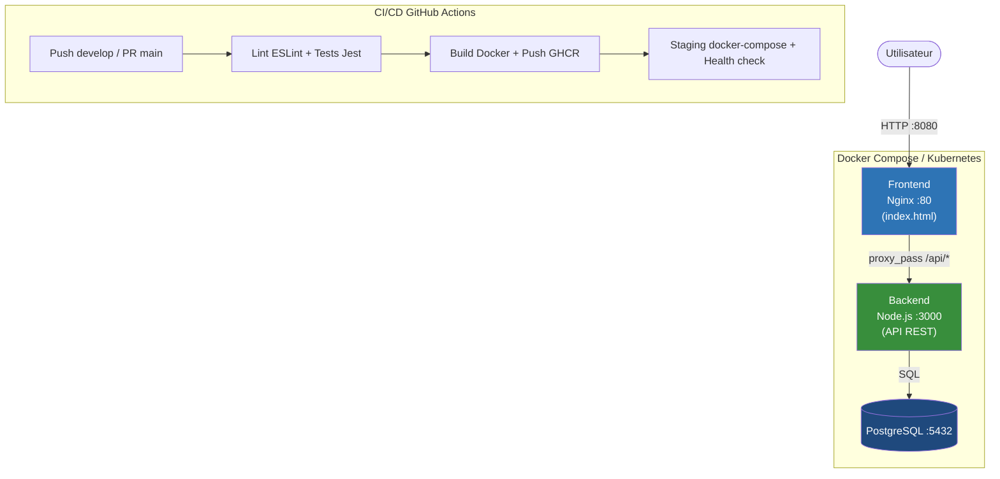

# VitalSync DevOps

Chaîne CI/CD conteneurisée pour l'application VitalSync (suivi médical et sportif).

## Architecture



## Prérequis

- Docker Desktop ≥ 24 (avec Docker Compose v2)
- Git ≥ 2.40
- Node.js 18 (pour les tests locaux uniquement)

## Lancer le projet localement

```bash
# 1. Copier et remplir le fichier d'environnement
cp .env.example .env

# 2. Lancer toute la stack
docker-compose up --build -d

# 3. Vérifier que les 3 conteneurs sont UP
docker ps

# 4. Accéder à l'application
#    http://localhost:8080  →  doit afficher "API: ok"

# 5. Tester directement le backend
curl http://localhost:3000/health
```

## Structure du projet

```
vitalsync/
├── .github/workflows/ci.yml     Pipeline CI/CD (lint → build → push → staging)
├── backend/
│   ├── test/health.test.js      Tests Jest (app Express isolée, pas d'import server.js)
│   ├── .dockerignore            Exclut node_modules/, test/, logs
│   ├── .eslintrc.js             Configuration ESLint (règles Node.js)
│   ├── Dockerfile               Multi-stage build (tests stage 1, prod stage 2)
│   ├── package.json             Express + Jest + Supertest + ESLint
│   └── server.js                API Express : GET /health, GET /api/activities
├── frontend/
│   ├── Dockerfile               nginx:alpine — copie index.html et nginx.conf
│   ├── index.html               Page avec fetch("/api/health") → affiche "API: ok"
│   └── nginx.conf               Sert les statiques + reverse-proxy /api/* → backend:3000
├── k8s/
│   ├── deployment-backend.yml   2 réplicas, liveness/readiness probes, Secret injecté
│   ├── deployment-frontend.yml  2 réplicas
│   ├── ingress.yml              Ingress nginx → frontend (port 80/443)
│   ├── secret-db.yml            Credentials DB encodés en base64
│   └── service-cluster.yml      ClusterIP backend/postgres, NodePort frontend
├── .env.example                 Variables d'environnement (sans valeurs réelles)
├── .gitignore                   Ignore node_modules/, .env, logs
└── docker-compose.yml           3 services + réseau bridge + volume pgdata
```

## Pipeline CI/CD

| Étape | Déclencheur | Ce qu'elle fait |
|---|---|---|
| **Lint & Tests** | Push `develop`, PR → `main`, Push `main` | ESLint + Jest |
| **Build & Push** | Push `main` uniquement | Build Docker multi-stage + push GHCR avec tag SHA |
| **Staging + Health check** | Après Build (push `main`) | `docker-compose up` + `curl /health` — échoue si API ne répond pas |

## Choix techniques

| Choix | Justification |
|---|---|
| `node:18-alpine` | Image ~150 Mo vs ~1 Go pour Debian — moins de surface d'attaque |
| `nginx:alpine` | Serveur de fichiers statiques léger, idéal pour un SPA |
| Multi-stage build | Sépare l'environnement de test de l'image de production |
| GitHub Actions + GHCR | Tout sur une même plateforme, authentification GITHUB_TOKEN sans secret supplémentaire |
| Tag SHA de commit | Traçabilité et rollback précis (contrairement à `latest` seul) |
| Volume `pgdata` | Les données PostgreSQL survivent aux `docker-compose down` |
| Réseau bridge dédié | Isolation : seul le frontend est exposé publiquement, la BDD est invisible |
| 2 réplicas K8s | Tolère la panne d'un pod, permet les rolling updates sans downtime |

## Commandes utiles

```bash
# Tests unitaires
cd backend && npm install && npm test

# Lint
cd backend && npm run lint

# Logs d'un service
docker-compose logs backend

# Arrêt (sans supprimer les données)
docker-compose down

# Arrêt + suppression du volume (ATTENTION : perte des données)
docker-compose down -v
```

## Variables d'environnement

| Variable | Description |
|---|---|
| `DB_USER` | Nom d'utilisateur PostgreSQL |
| `DB_PASSWORD` | Mot de passe PostgreSQL |
| `DB_NAME` | Nom de la base de données |

## Kubernetes

> Remplacer `TON_USERNAME` dans `k8s/deployment-backend.yml` et `k8s/deployment-frontend.yml`
> par ton pseudo GitHub en minuscules.

```bash
kubectl apply -f k8s/secret-db.yml
kubectl apply -f k8s/deployment-backend.yml
kubectl apply -f k8s/deployment-frontend.yml
kubectl apply -f k8s/service-cluster.yml
kubectl apply -f k8s/ingress.yml
```
